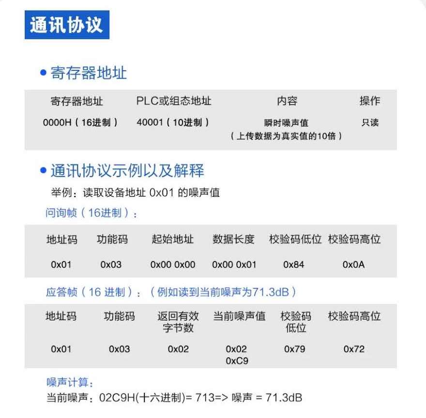
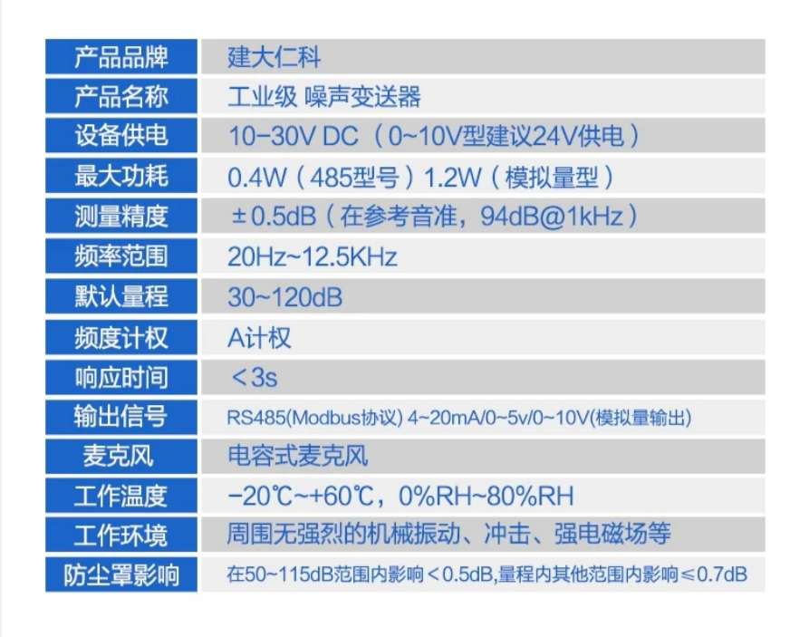
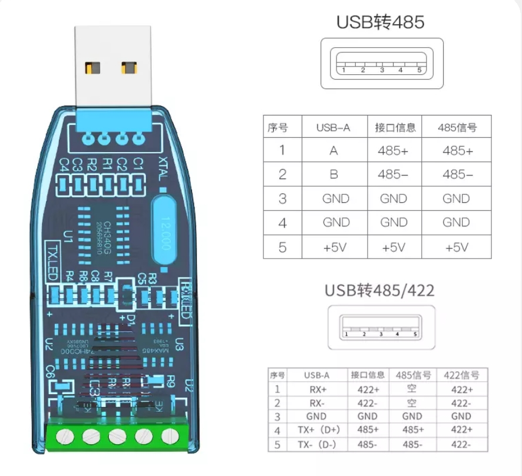

# Device
## 1. Windows 10 PC with USB port
## 2. Noise Sensor (RS485 interface)
- Send request: 01 03 00 00 01 84 0A
- Response in bytes
    1. address code: 01
    2. Function code: 03
    3. number of bytes for return values: 02
    4. return sound level: 2 bytes hex.  result/10 = decibels
    5. CRC low
    6. CRC high

- Power input: 10-30V DC

## 3. RS485 to USB convertor
+ connect 485+ to port 4
+ connect 485- to port5

# Software
## 1. Python (manu_ser.py)
check your environement and update following parameters in code
+ COM port
+ remote Kafka broker IP and port
+ topic name on the remote Kafka cluster (it should be the same as the Event Hub name on Azure Event Hub Namespaces explained in the cloud section)
+ set the appropriate sampling interval 
## 2. Visual Studio Code or other Python IDE
