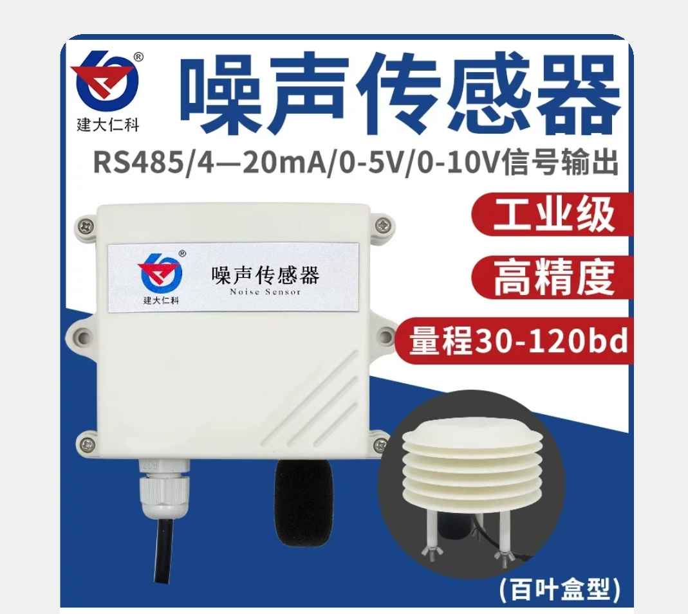
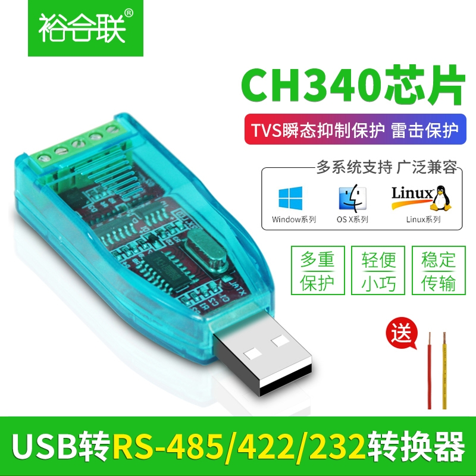

# Introduction of simple-dbmeter
 a simple dbmeter to test Kafka, mirrormaker, Azure Event Hub and Stream Analytics Job

# Overall architecture

 

# HW & Service **Costs**

<table class=MsoTableGrid border=1 cellspacing=0 cellpadding=0 width=642
 style='width:481.7pt;border-collapse:collapse;border:none'>
 <tr>
  <td width=120 valign=top style='width:90.1pt;border:solid windowtext 1.0pt;
  padding:0cm 5.4pt 0cm 5.4pt'>
  
Component

  </td>
  <td width=120 valign=top style='width:90.1pt;border:solid windowtext 1.0pt;
  border-left:none;padding:0cm 5.4pt 0cm 5.4pt'>
  
OTC
  (RMB/USD)

  </td>
  <td width=128 valign=top style='width:96.0pt;border:solid windowtext 1.0pt;
  border-left:none;padding:0cm 5.4pt 0cm 5.4pt'>
  
MRC
  (RMB/USB)

  </td>
  <td width=274 valign=top style='width:205.5pt;border:solid windowtext 1.0pt;
  border-left:none;padding:0cm 5.4pt 0cm 5.4pt'>
  
Comments

  </td>
 </tr>
 <tr>
  <td width=120 valign=top style='width:90.1pt;border:solid windowtext 1.0pt;
  border-top:none;padding:0cm 5.4pt 0cm 5.4pt'>
  

  </td>
  <td width=120 valign=top style='width:90.1pt;border-top:none;border-left:
  none;border-bottom:solid windowtext 1.0pt;border-right:solid windowtext 1.0pt;
  padding:0cm 5.4pt 0cm 5.4pt'>
  
240
  RMB/

  
34
  USD

  </td>
  <td width=128 valign=top style='width:96.0pt;border-top:none;border-left:
  none;border-bottom:solid windowtext 1.0pt;border-right:solid windowtext 1.0pt;
  padding:0cm 5.4pt 0cm 5.4pt'>
  
0

  </td>
  <td width=274 valign=top style='width:205.5pt;border-top:none;border-left:
  none;border-bottom:solid windowtext 1.0pt;border-right:solid windowtext 1.0pt;
  padding:0cm 5.4pt 0cm 5.4pt'>
  
Bought
  from Taobao.com

  </td>
 </tr>
 <tr>
  <td width=120 valign=top style='width:90.1pt;border:solid windowtext 1.0pt;
  border-top:none;padding:0cm 5.4pt 0cm 5.4pt'>
  

  </td>
  <td width=120 valign=top style='width:90.1pt;border-top:none;border-left:
  none;border-bottom:solid windowtext 1.0pt;border-right:solid windowtext 1.0pt;
  padding:0cm 5.4pt 0cm 5.4pt'>
  
35
  RMB/

  
5
  USD

  </td>
  <td width=128 valign=top style='width:96.0pt;border-top:none;border-left:
  none;border-bottom:solid windowtext 1.0pt;border-right:solid windowtext 1.0pt;
  padding:0cm 5.4pt 0cm 5.4pt'>
  
0

  </td>
  <td width=274 valign=top style='width:205.5pt;border-top:none;border-left:
  none;border-bottom:solid windowtext 1.0pt;border-right:solid windowtext 1.0pt;
  padding:0cm 5.4pt 0cm 5.4pt'>
  
Bought
  from Taobao.com

  </td>
 </tr>
 <tr>
  <td width=120 valign=top style='width:90.1pt;border:solid windowtext 1.0pt;
  border-top:none;padding:0cm 5.4pt 0cm 5.4pt'>
  

  </td>
  <td width=120 valign=top style='width:90.1pt;border-top:none;border-left:
  none;border-bottom:solid windowtext 1.0pt;border-right:solid windowtext 1.0pt;
  padding:0cm 5.4pt 0cm 5.4pt'>
  
34
  RMB/

  
5
  USD

  </td>
  <td width=128 valign=top style='width:96.0pt;border-top:none;border-left:
  none;border-bottom:solid windowtext 1.0pt;border-right:solid windowtext 1.0pt;
  padding:0cm 5.4pt 0cm 5.4pt'>
  
0

  </td>
  <td width=274 valign=top style='width:205.5pt;border-top:none;border-left:
  none;border-bottom:solid windowtext 1.0pt;border-right:solid windowtext 1.0pt;
  padding:0cm 5.4pt 0cm 5.4pt'>
  
Bought
  from Taobao.com

  </td>
 </tr>
 <tr>
  <td width=120 valign=top style='width:90.1pt;border:solid windowtext 1.0pt;
  border-top:none;padding:0cm 5.4pt 0cm 5.4pt'>
  
Azure
  Event Hub (standard, 1 thoughput unit, no capture)

  </td>
  <td width=120 valign=top style='width:90.1pt;border-top:none;border-left:
  none;border-bottom:solid windowtext 1.0pt;border-right:solid windowtext 1.0pt;
  padding:0cm 5.4pt 0cm 5.4pt'>
  
&nbsp;

  </td>
  <td width=128 valign=top style='width:96.0pt;border-top:none;border-left:
  none;border-bottom:solid windowtext 1.0pt;border-right:solid windowtext 1.0pt;
  padding:0cm 5.4pt 0cm 5.4pt'>
  
154
  RMB/

  
22
  USD

  </td>
  <td width=274 valign=top style='width:205.5pt;border-top:none;border-left:
  none;border-bottom:solid windowtext 1.0pt;border-right:solid windowtext 1.0pt;
  padding:0cm 5.4pt 0cm 5.4pt'>
  
·&nbsp;&nbsp;&nbsp;&nbsp;&nbsp;
  Need standard tier to support Kafka endpoint

  
·&nbsp;&nbsp;&nbsp;&nbsp;&nbsp;
  1 throughput unit allows 1MB/s ingress and 2MB/s
  egress

  
·&nbsp;&nbsp;&nbsp;&nbsp;&nbsp;
  Deployed in Central US

  </td>
 </tr>
 <tr>
  <td width=120 valign=top style='width:90.1pt;border:solid windowtext 1.0pt;
  border-top:none;padding:0cm 5.4pt 0cm 5.4pt'>
  
Azure
  Stream Analytics (standard, 1 streaming unit)

  </td>
  <td width=120 valign=top style='width:90.1pt;border-top:none;border-left:
  none;border-bottom:solid windowtext 1.0pt;border-right:solid windowtext 1.0pt;
  padding:0cm 5.4pt 0cm 5.4pt'>
  
&nbsp;

  </td>
  <td width=128 valign=top style='width:96.0pt;border-top:none;border-left:
  none;border-bottom:solid windowtext 1.0pt;border-right:solid windowtext 1.0pt;
  padding:0cm 5.4pt 0cm 5.4pt'>
  
560
  RMB/

  
80
  USD

  </td>
  <td width=274 valign=top style='width:205.5pt;border-top:none;border-left:
  none;border-bottom:solid windowtext 1.0pt;border-right:solid windowtext 1.0pt;
  padding:0cm 5.4pt 0cm 5.4pt'>
  
·&nbsp;&nbsp;&nbsp;&nbsp;&nbsp;
  Deployment in Central US

  
·&nbsp;&nbsp;&nbsp;&nbsp;&nbsp;
  Default streaming unit is 3

  </td>
 </tr>
 <tr>
  <td width=120 valign=top style='width:90.1pt;border:solid windowtext 1.0pt;
  border-top:none;padding:0cm 5.4pt 0cm 5.4pt'>
  
PowerBI
  license

  </td>
  <td width=120 valign=top style='width:90.1pt;border-top:none;border-left:
  none;border-bottom:solid windowtext 1.0pt;border-right:solid windowtext 1.0pt;
  padding:0cm 5.4pt 0cm 5.4pt'>
  
&nbsp;

  </td>
  <td width=128 valign=top style='width:96.0pt;border-top:none;border-left:
  none;border-bottom:solid windowtext 1.0pt;border-right:solid windowtext 1.0pt;
  padding:0cm 5.4pt 0cm 5.4pt'>
  
0

  </td>
  <td width=274 valign=top style='width:205.5pt;border-top:none;border-left:
  none;border-bottom:solid windowtext 1.0pt;border-right:solid windowtext 1.0pt;
  padding:0cm 5.4pt 0cm 5.4pt'>
  
·&nbsp;&nbsp;&nbsp;&nbsp;&nbsp;
  Come with company O365 suit

  </td>
 </tr>
</table>

&nbsp;

# Setup & Test
## 1. [Setup the edge (the collector on PC)](Jul-2020/Edge/Setup-Collector-PC.md)
## 2. [Setup the Bus (Kafka cluster & MirrorMaker)](Jul-2020/Bus/Setup-MsgBus.md)
## 3. [Setup Azure Cloud and PowerBI](Jul-2020/Cloud/Setup-Azure.md)

# Get it run
- Connect the sensor to RS485toUSB adaptor and DC power supply.
- Plug the RS485toUSB adaptor to PC
- On the MsbBus box, start the Kafka cluster with MirrorMaker. can send a test message on local to Kafka cluster and ensure it reaches and shown in PowerBI dashboard.
- on the PC, check the network connection to MsbBus box and run the manu_ser.py.

# Other Comments 
